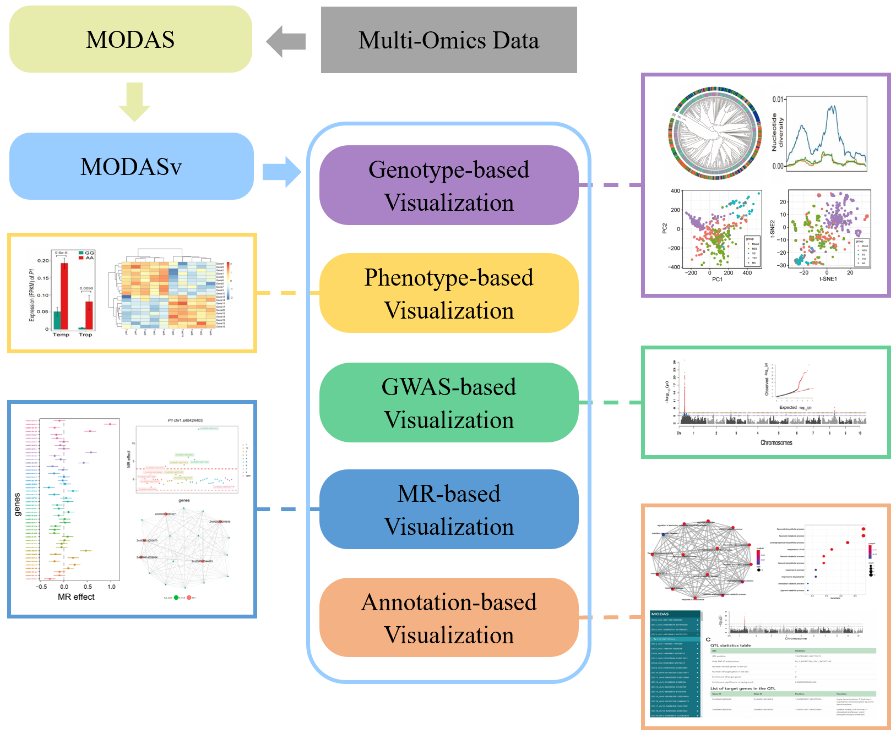

# MODASv

MODASv is a multifunctional visualization toolkit. It seamlessly accepts the results from [MODAS](https://github.com/liusy-jz/MODAS), and visualizes the results in various forms, such as manhattan plot, forest plot, network plot, etc.

MODASv was mainly developed in Python3 and R language, and integrated multiple third-party tools to simplify the complexity of function implementation. According to the content of the analysis, the functional modules of MODASv can be divided into 5 categories:
1) Genotype information based visualization
2) Phenotype based visualization
3) GWAS results based visualization
4) Mendelian randomization(MR) analysis based visualization
5) Annotation information based visualization

